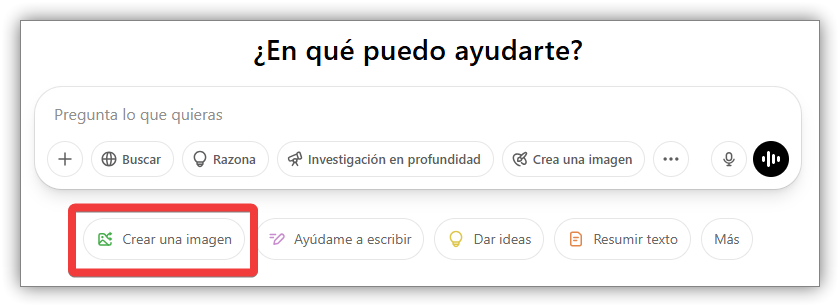
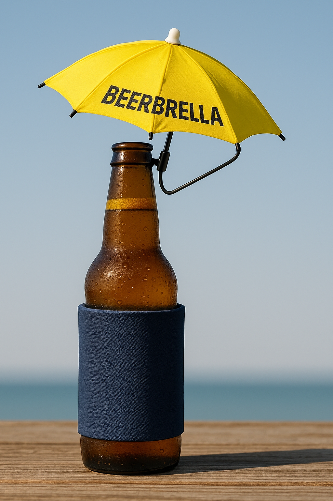
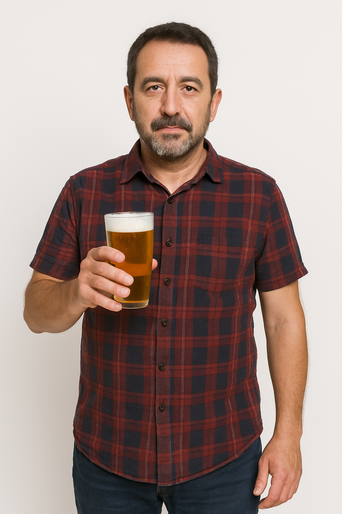
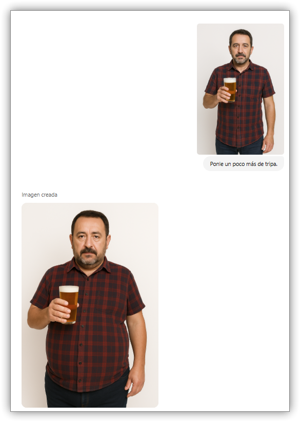
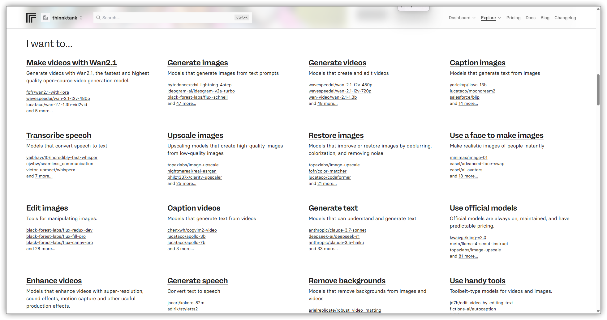
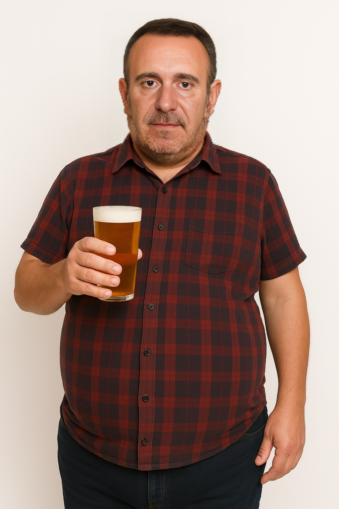
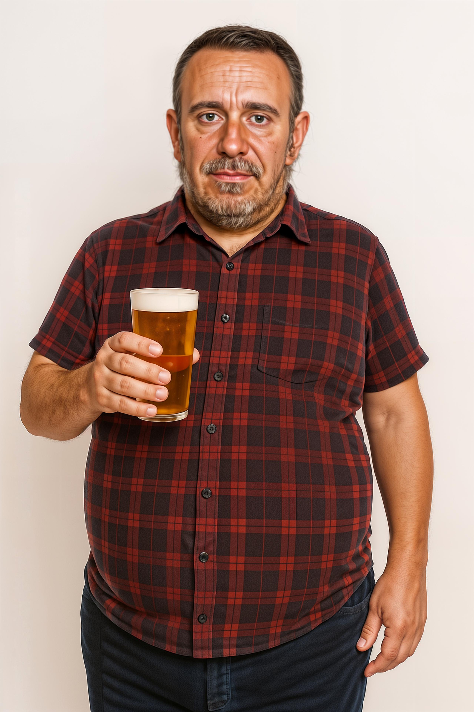
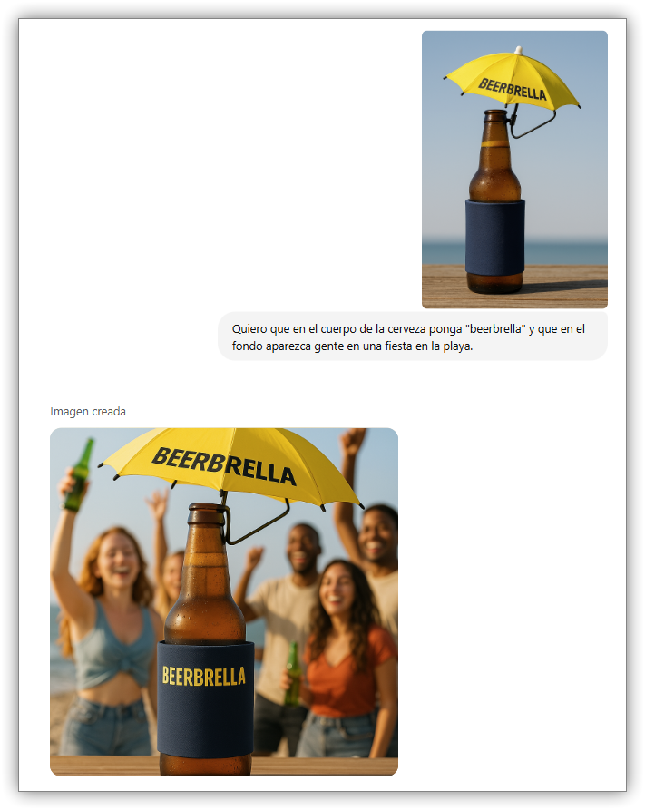

public:: true

- ## Evolución de la inteligencia artificial aplicada a la generación de  imágenes
- ## Herramientas de IA imagen
	- Elección de la herramienta concreta
		- Principio de pareto.
		- Directorios de aplicaciones basadas en IA
		- Herramientas propietarias versus Open Source
		- Funcionalidad, SaaS, API o local
		- Para utilizar en tu trabajo
		- Para utilizar en esta clase
			- ChatGPT
			- Replicate
			- Leonardo
			- Pinokio
- ## Funcionalidades de la inteligencia artificial para la generación de imagen
	- Creación de imágenes a partir de promts de texto
	- Creación de imágenes a partir de imágenes
	- Edición de imágenes con out paint e in painting.
	- Creación de personajes consistentes
	- Quitar el fondo a una imagen
	- Crear una imagen de producto a partir de una foto de mala calidad.
	- Aumentar la resolución de una imagen
	- Generar un modelo 3D a partir de una descripción de texto
	- Generación de texto dentro de una imagen
	- Creación de logos
	- ...
- ## Preparación del entorno de trabajo
	- Necesitas
		- Una cuenta de Google
		- Una cuenta de [Chat GPT](https://chatgpt.com/)
		- Una cuenta de [Leonardo.ai](https://leonardo.ai/)
		- Una carpeta de Google Drive llamada [EOI-IA-1 Carpeta de trabajo]("https://drive.google.com/drive/folders/1Yf1SwV3SgoEuY0yDKaa9s27yMXcVh_R8)
		- Una idea de negocio o producto
			- Beerbrella Patente: [https://patents.google.com/patent/US2...](https://patents.google.com/patent/US6637447B2/en)
- ## Generación de imágenes desde texto (Text-to-Image)
  collapsed:: true
	- **Descripción**: Crear imágenes originales a partir de descripciones en lenguaje natural.
	- ### Foto de producto.
		- Prompt:
			- ```
			  The present invention provides a small umbrella (“Beerbrella”) which may be removably attached to a beverage container in order to shade the beverage container from the direct rays of the sun. The apparatus comprises a small umbrella approximately five to seven inches in diameter, although other appropriate sizes may be used within the spirit and scope of the present invention. Suitable advertising and/or logos may be applied to the umbrella surface for promotional purposes. The umbrella may be attached to the beverage container by any one of a number of means, including clip, strap, cup, foam insulator, or as a coaster or the like. The umbrella shaft may be provided with a pivot to allow the umbrella to be suitably angled to shield the sun or for aesthetic purposes. In one embodiment, a pivot joint and counterweight may be provided to allow the umbrella to pivot out of the way when the user drinks from the container.
			  ```
		- ChatGPT
			- {:height 174, :width 555}
		- [Invención de Beerbrella](https://chatgpt.com/share/6810c2c6-fe8c-800c-9ba1-682b71e568e3)
			- 
	- ### Foto de persona
		- [Bebedor de cerveza español](https://chatgpt.com/share/6810c535-4f48-800c-8e5f-9d233a6fa74d)
			- 
- ## Transformación de imágenes (Image-to-Image)
  collapsed:: true
	- **Descripción**: Tomar una imagen de entrada y generar variaciones manteniendo el estilo o contenido.
	- **Prompt**: `Ponle un poco más de tripa`
	- 
	- ## Eliminación de fondo y segmentación
	  
	  **Descripción**: Separar sujeto y fondo para montajes o transparencias.
	-
	- 
	- [Explore – Replicate](https://replicate.com/explore#featured-models)
	- ## 3. Edición de imágenes (Sustituir cara)
	  
	  **Descripción**: A partir de una imagen de referencia de una persona, sustituye su cara con la imagen de otra cara.
		- [Prediction cdingram/face-swap – Replicate](https://replicate.com/p/sdwjfxza0drj60cpg6nv7z65zr)
		- {:height 527, :width 346}
	-
- ## Edición de imágenes (Upscaling)
  collapsed:: true
	- **Descripción**: Mejora la calidad de una imagen ampliando sus dimensiones y refinando los detalles.
	- [Prediction fermatresearch/high-resolution-controlnet-tile – Replicate](https://replicate.com/p/60wfkgat8srma0cpg6ra98byeg)
	- 
	- ## Edición de imágenes mediante texto
		- [Cerveza personalizada playa fiesta](https://chatgpt.com/c/6810d739-dc88-800c-8f9d-149264d8b0b3)
		- 
- ## Modelado 3D a partir de texto o imagen
  
  **Descripción**: Generar mallas y entornos 3D.
	- https://lumalabs.ai/genie?view=create
- ## Recursos adicionales
	- **Leonardo AI**: [https://www.leonardo.ai/](https://www.leonardo.ai/)
	- **Replicate**: [https://www.replicate.com/](https://www.replicate.com/)
	- **Pinokio**: [https://pinokio.computer/](https://pinokio.computer/)
- ## Automatización de creación de imágenes
	- Consideraciones éticas ilegales de la generación de imágenes con IA.
	- Sesgos en la generación de imágenes con IA.
- ## Ejemplos de cosas que se pueden hacer con inteligencia artificial en imagen y vídeo
	- **12:33** [[quick capture]]:  Actualización de películas con IA #innovación #inteligenciaartificial #video - YouTube {{video https://www.youtube.com/watch?v=wVH1GcpcNFg}}
		- @misc{ai_2024, title={Luma Dream Machine}, url={[https://lumalabs.ai/dream-machine](https://www.youtube.com/redirect?event=video_description&redir_token=QUFFLUhqbkdQN2JwbTlYcllaY2tlU0hlVHY2TjI3LWlxQXxBQ3Jtc0traERQcmRZVl9fWDJyampYcThaYWNsM1VabE5NY2p6RUVjZFVkZVRYN1F2SnlpclEySkhyT2ZKWEJWYnJFM1VjcWpuRUhWeC1UaTJhUTM1Y1RQd0hSX2htWVVobGNyU1VKWHN5cjdpT25KdHg0bXZjYw&q=https%3A%2F%2Flumalabs.ai%2Fdream-machine&v=wVH1GcpcNFg)}, journal={Luma Dream Machine}, author={AI, Luma}, year={2024} }
		- En un escenario hipotético de rodaje en 2024, escenas icónicas del cine como la de "Casablanca" serían capturadas en selfies para Instagram. La tecnología actual podría recrear videos de alta calidad a partir de una simple foto y un texto con instrucciones. Otras películas como "Con la muerte en los talones" y "Cantando bajo la lluvia" se adaptarían al uso de drones y al cambio climático, respectivamente.
	- **12:37** [[quick capture]]:  Inteligencia Artificial y robótica - YouTube {{video https://www.youtube.com/watch?v=mFAMwTxULhw}}
	- **12:42** [[quick capture]]:  Texto a impresión 3D con inteligencia artificial - YouTube {{video https://www.youtube.com/watch?v=5HW13lm2RMQ}}
	- Inteligencia Artificial para traducir vídeos - YouTube {{video https://www.youtube.com/watch?v=nPEUs9ifZzY}}
	- **12:45** [[quick capture]]:  Inteligencia artificial para detectar cáncer #innovacion #ia - YouTube {{video https://www.youtube.com/watch?v=mbghc4c_QrY}}
	- **12:46** [[quick capture]]:  De imagen a modelo 3D con IA #innovacion #inteligenciaartificial #video - YouTube {{video https://www.youtube.com/watch?v=F6p6k5Vz3RE}}
	- **12:48** [[quick capture]]:  Añade efectos especiales a tu video con IA #innovación #video #inteligenciaartificial - YouTube {{video https://www.youtube.com/watch?v=cnp9A__4Egw}}
	- **12:49** [[quick capture]]:  Deepfakes y suplantación de identidad #innovacion #seguridad #inteligenciaartificial - YouTube {{video https://www.youtube.com/watch?v=RMUzzEg1Uhg}}
	- **12:51** [[quick capture]]:  Texto a vídeo con inteligencia artificial - YouTube {{video https://www.youtube.com/watch?v=-TV8rwwCne0}}
	- **12:52** [[quick capture]]:  Inteligencia artificial crea vídeos a partir de texto - YouTube {{video https://www.youtube.com/watch?v=cx4M6RQkcaI}}
	- **12:53** [[quick capture]]:  Inteligencia artificial para borrar cosas de vídeos - YouTube {{video https://www.youtube.com/watch?v=mKbe2MUh60o}}
	- **12:54** [[quick capture]]:  La inteligencia artificial ángel o demonio - YouTube {{video https://www.youtube.com/watch?v=1mQWcoSRYeE}}
	- **12:56** [[quick capture]]:  RunwayML gen 2 Crea vídeos a partir de texto #innovación #vídeo vertical subtitles - YouTube {{video https://www.youtube.com/watch?v=NfGh0_8576s}}
	- **12:58** [[quick capture]]:  Leonardo ai crea tu foto de prom #innovacion #ia #text2image - YouTube {{video https://www.youtube.com/watch?v=3qZQH8uf8uY}}
		- #LORA
	- **13:00** [[quick capture]]:  Crea un personaje con Dall e 3 #innovacion #inteligenciaartificial - YouTube {{video https://www.youtube.com/watch?v=G4AeRTs3HDc}}
	- **13:02** [[quick capture]]:  IA mezcla foto y vídeo #innovación #inteligenciaartificial - YouTube {{video https://www.youtube.com/watch?v=M60rKxEcvnw}}
	- **13:03** [[quick capture]]:  Crea canciones con inteligencia artificial #innovación #inteligenciaartificial #música - YouTube {{video https://www.youtube.com/watch?v=Dk_Eg_zCkuA}}
	- **13:04** [[quick capture]]:  Clona estilos musicales con IA (suno) #innovación #música #inteligenciaartificial - YouTube {{video https://www.youtube.com/watch?v=-dlEgstx6qY}}
	- **13:05** [[quick capture]]:  De ecografía 3D a rostro con IA #innovacion #inteligenciaartificial #medicina - YouTube {{video https://www.youtube.com/watch?v=xrWTWHbNmEk&t=13s}}
	- **13:08** [[quick capture]]:  App para generar tu avatar super realista - YouTube {{video https://www.youtube.com/watch?v=a9OQthbAYhQ&t=18s}}
	- **13:08** [[quick capture]]:  Avatar creado con inteligencia artificial - YouTube {{video https://www.youtube.com/watch?v=vOPX3UYZJEQ}}
	- **13:11** [[quick capture]]:  Crea vídeos con una foto y un texto con vidu.estudio #innovación #inteligenciaartificial #vídeo - YouTube {{video https://www.youtube.com/watch?v=vw13hKt1xPU&t=9s}}
	- **13:12** [[quick capture]]:  Imagen a texto con Inteligencia Artificial #innovacion #IA - YouTube {{video https://www.youtube.com/watch?v=Es65cvCrw6k}}
-